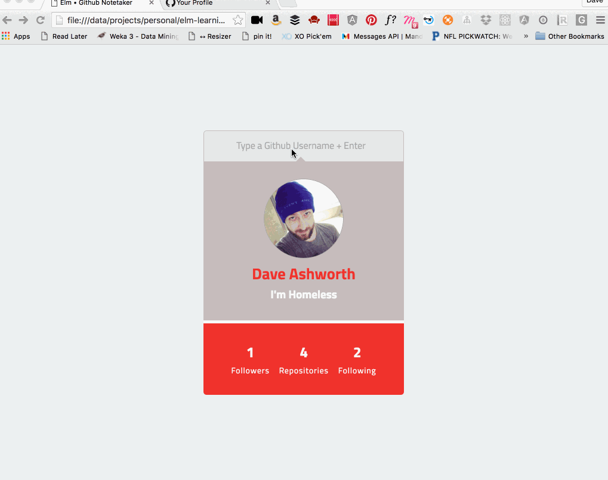

# github-note-taker
A Sample Elm App for learning Elm & Viewing Github Profiles

Created as part of Hackathon for HigherEducation.com 2016

There were also [Slides][] involved for the presentation...
[Slides]: http://slides.com/daveashworth/deck/live

## To Run
Make sure you have [Elm][] installed

[Elm]: http://elm-lang.org/get-started

cd to the project directory

Run `elm-make Main.elm --output elm.js`

Then open `index.html` in a browser, and enjoy!

